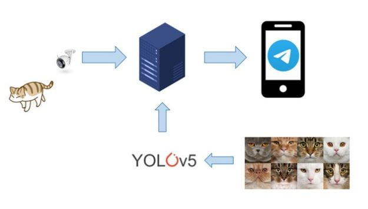
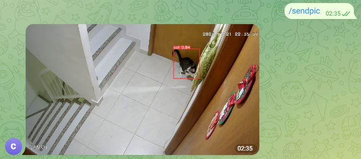
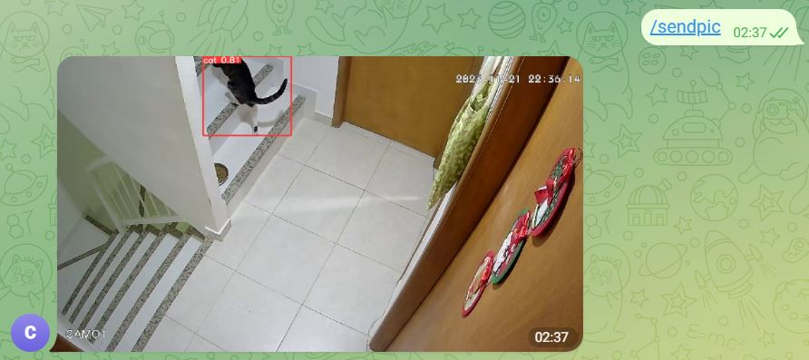
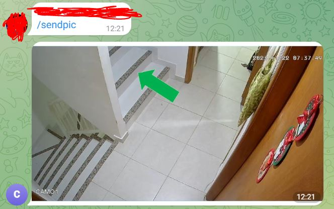
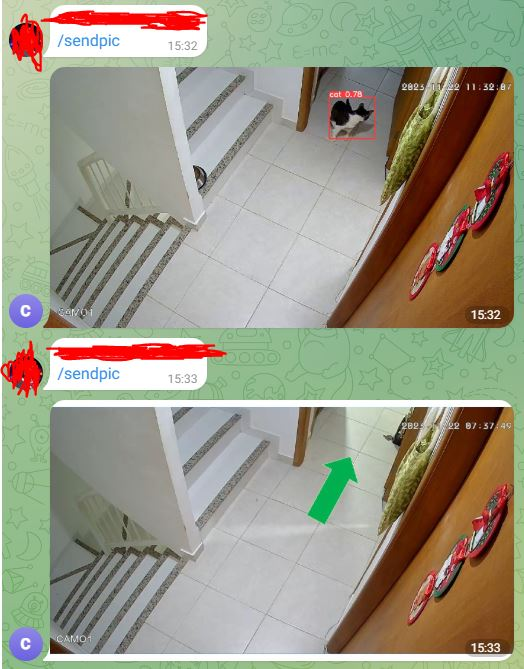
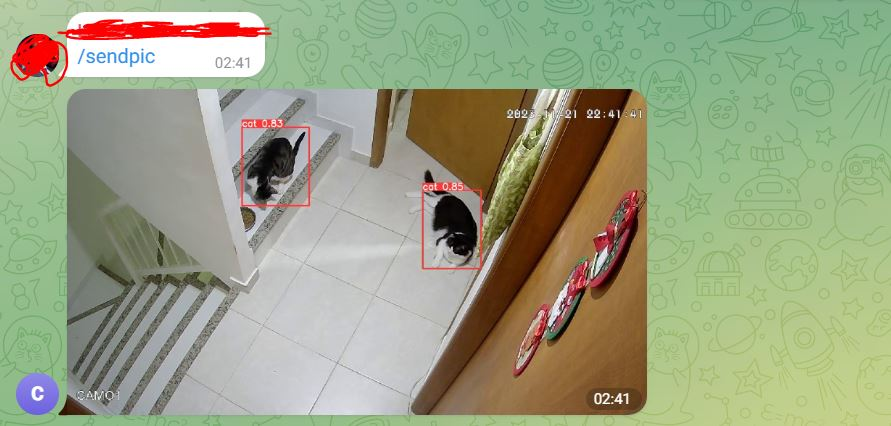
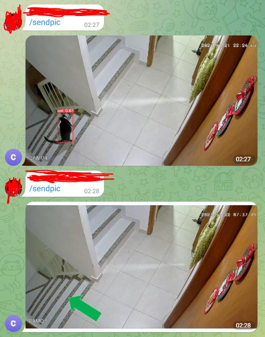
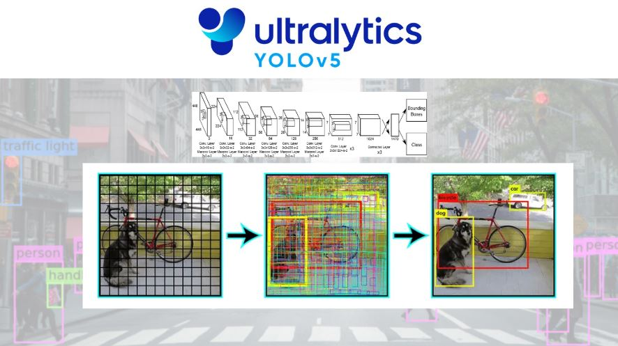
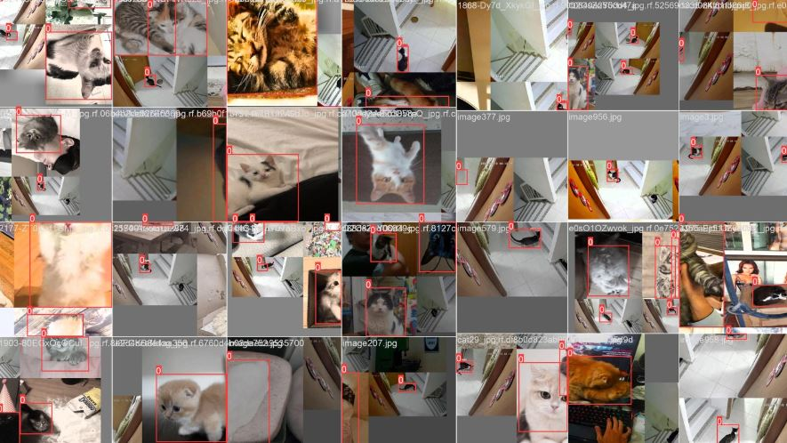

# CatTracker

The project aims to detect cats inside a house using cameras and inform the owner via cell phone. The objective is to allow the owner to know where the cat is, especially if it likes to hide when you are looking for it. 

Project proposed and developped by a group of 3 people for a university discipline at the Federal University of Rio de Janeiro.

## Usage Demonstration

I invite you to watch the [video](https://www.youtube.com/watch?v=BPeSk91SadU&ab_channel=DanielMatheusPeclatdeMelloCordeiro) of the project showing its functionality. It is in Portuguese, but it's possible to comprehend the idea 😊.

Below are some pictures that show the usage of the software. With a Telegram bot, the person can send the message "/sendpic," and the system will send a photo corresponding to the last time the cat was seen. If the cat has not been seen for a long time, it will show a photo with the direction that the cat was last seen. These behaviors can be seen in the following pictures:

## Implementation

The detection of the cats was done by the Yolo-v5 model. 

My part of the project was to fine-tune this model with data of cats to specialize it on this task. It was used images of cats from the internet, and later also images captured from the camera in the environment that would be used, when we noted a significant rise in performance. 

